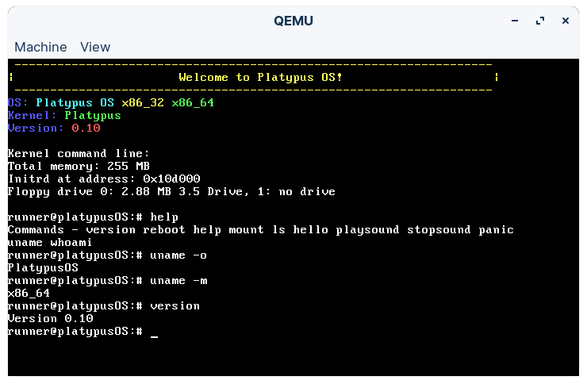

# Platypus OS
New OS drafts, I stopped the old one :(
  
Chat about development on [Discord](https://discord.gg/t6keJw974q)!

# What this is for
I want it to be for:
1. Programming
2. Pentesting
3. Playing video games

Seems like an odd combination, but that's what I like to do: program, pentest, and play video games.

# Building
To build the OS, read the [build guide](docs/Building.md).

# Screenshot
Version 0.10 (GitHub Actions Build ISO)

# Acknowledgments
## Projects
- [pdclib](https://github.com/DevSolar/pdclib)
- [libc11](https://github.com/dryc/libc11)

# License
This project is licensed under GPL v2. See the [`LICENSE`](LICENSE) file for more info.
